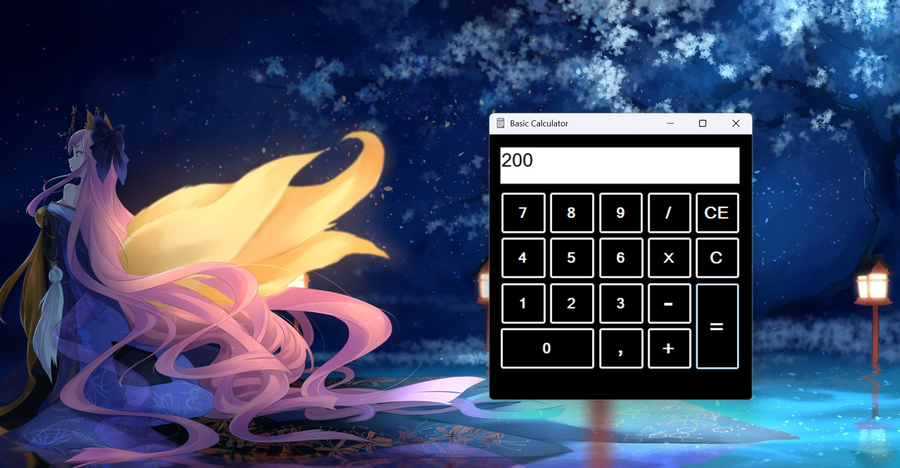

[](https://github.com/ellerbrock/open-source-badges/)
[](https://opensource.org/licenses/MIT)


# Basic-Calculator-with-C-Sharp
Basic Calculator is a simple desktop calculator application developed using the C# programming language. This application is capable of performing basic arithmetic operations such as addition, subtraction, multiplication, and division, with support for both whole and decimal number input. Features include Clear Entry (CE) to delete the last entered number, Clear (C) to reset the entire calculation, and real-time display of results on the display box. This project was completed in 1 day and designed as a practical example for learning the basics of GUI programming in C#.

<br><br>

## Project Requirements
| Part | Description |
| --- | --- |
| Features | • Input<br>• Output<br>• Basic Arithmetic Operations<br>• Calculation Execution<br>• Clear/Reset Function |
| Theme | Dark |
| Tools | Visual Studio 2015 |
| Code | C# |
| Operation System | Windows 11 |

<br><br>

## Download & Install Visual Studio 2015 Enterprise
<table><tr><td width="840">
  
```
https://bit.ly/VS_Enterprise_2015_Installer
```

</td></tr></table>

<br><br>

## Get Started
1. Download this repository.<br>
2. Extract the file.<br>
3. Run the application program through Visual Studio 2015 or by clicking on the basic_calculator (.exe) application.<br>
4. Please enjoy [Done].

<br><br>

## Highlights
<table>
<tr>
<th width="840">Experiment</th>
</tr>
<tr>
<td></td>
</tr>
</table>

<br><br>

## Appreciation
If this work is useful to you, then support this work as a form of appreciation to the author by clicking the ``` ⭐Star ``` button at the top of the repository.

<br><br>

## Disclaimer
This application is my own work and is not the result of plagiarism from other people's research or work, except those related to third party services which include: libraries, frameworks, and so on.

<br><br>

## LICENSE
MIT License - Copyright © 2025 - Devan C. M. Wijaya, S.Kom

Permission is hereby granted without charge to any person obtaining a copy of this software and the software-related documentation files to deal in them without restriction, including without limitation the right to use, copy, modify, merge, publish, distribute, sublicense, and/or sell copies of the Software, and to permit persons receiving the Software to be furnished therewith on the following terms:

The above copyright notice and this permission notice must accompany all copies or substantial portions of the Software.

IN ANY EVENT, THE AUTHOR OR COPYRIGHT HOLDER HEREIN RETAINS FULL OWNERSHIP RIGHTS. THE SOFTWARE IS PROVIDED AS IS, WITHOUT WARRANTY OF ANY KIND, EITHER EXPRESS OR IMPLIED, THEREFORE IF ANY DAMAGE, LOSS, OR OTHERWISE ARISES FROM THE USE OR OTHER DEALINGS IN THE SOFTWARE, THE AUTHOR OR COPYRIGHT HOLDER SHALL NOT BE LIABLE, AS THE USE OF THE SOFTWARE IS NOT COMPELLED AT ALL, SO THE RISK IS YOUR OWN.
